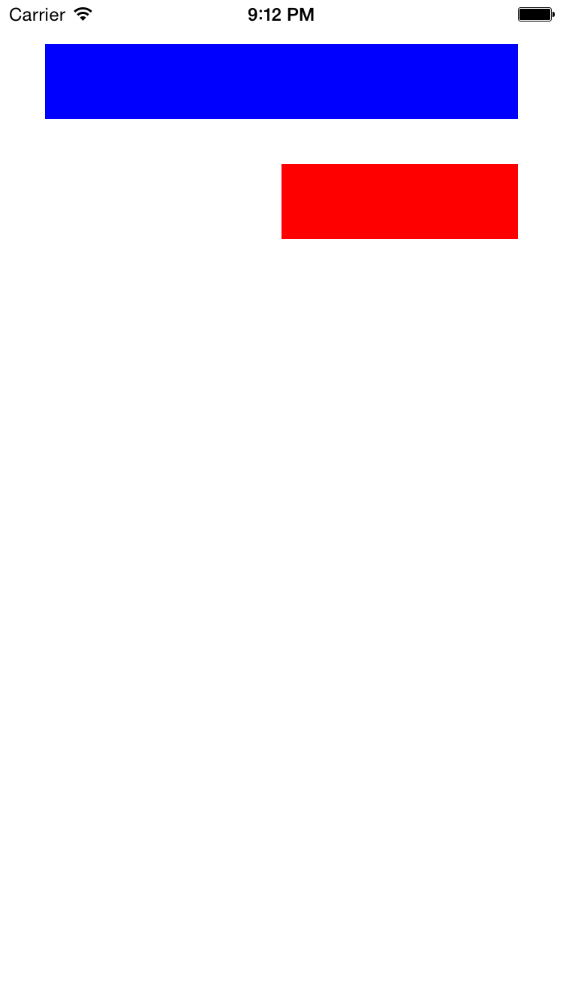
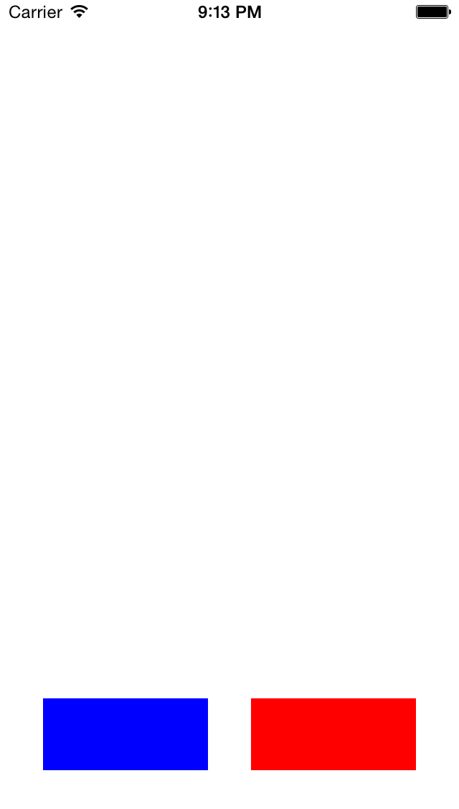

# iOS 自动布局VFL入门教程

# 什么是VFL语言

VFL（Visual Format Language），“可视化格式语言”。

VFL是苹果公司为了简化autolayout的编码而推出的抽象语言。

# 语法说明


```
H:[cancelButton(72)]-12-[acceptButton(50)]
```
cancelButton宽72，acceptButton宽50，它们之间间距12
 

```
H:[wideView(>=60@700)]
```
wideView宽度大于等于60point，该约束条件优先级为700（优先级最大值为1000，优先级越高的约束条件越先被满足）

```  
V:[redBox][yellowBox(==redBox)]
```
垂直方向上，先有一个redBox，其下方紧接一个高度等于redBox高度的yellowBox

```  
H:|-10-[Find]-[FindNext]-[FindField(>=20)]-|
```
水平方向上，Find距离父view左边缘间隔10，之后是FindNext距离Find间隔默认宽度；再之后是宽度不小于20的FindField，它和FindNext以及父view右边边缘的间距都是默认宽度。（竖线“|”表示superview的边缘）。

# 使用方法

使用VFL来创建约束数组

```
+(NSArray *)constraintsWithVisualFormat:(NSString *)format options:(NSLayoutFormatOptions)opts metrics:(NSDictionary *)metrics views:(NSDictionary *)views;
```
  
> format：VFL语句
> opts：约束类型
> metrics：VFL语句中用到的具体数值
> views：VFL语句中用到的控件
  
创建一个字典（内部包含VFL语句中用到的控件）的快捷宏定义

```
NSDictionaryOfVariableBindings(...)
```
# 实例展示

效果图：

  

实现代码：

```

-(void)horizontalLayout{
    //1.添加两个控件
    UIView *blueView = [[UIView alloc] init];
    blueView.backgroundColor = [UIColor blueColor];
    
    blueView.translatesAutoresizingMaskIntoConstraints = NO;
    [self.view addSubview:blueView];
    
    UIView *redView = [[UIView alloc] init];
    redView.backgroundColor = [UIColor redColor];
    redView.translatesAutoresizingMaskIntoConstraints = NO;
    [self.view addSubview:redView];
    
    //2.添加约束
    //2.1水平方向的约束
    NSString *hVFL = @"H:|-30-[blueView]-30-[redView(==blueView)]-30-|";
    NSArray *hCons = [NSLayoutConstraint constraintsWithVisualFormat:hVFL options:NSLayoutFormatAlignAllBottom | NSLayoutFormatAlignAllTop metrics:nil views:@{@"blueView":blueView, @"redView":redView}];
    [self.view addConstraints:hCons];
    
    //2.2垂直方向的约束
    NSString *vVFL = @"V:[blueView(50)]-30-|";
    NSArray *vCons = [NSLayoutConstraint constraintsWithVisualFormat:vVFL options:0 metrics:nil views:@{@"blueView":blueView}];
    [self.view addConstraints:vCons];
}

-(void)verticalLayout{
    //1.添加两个控件
    UIView *blueView = [[UIView alloc] init];
    blueView.backgroundColor = [UIColor blueColor];
    blueView.translatesAutoresizingMaskIntoConstraints = NO;
    [self.view addSubview:blueView];

    UIView *redView = [[UIView alloc] init];
    redView.backgroundColor = [UIColor redColor];
    redView.translatesAutoresizingMaskIntoConstraints = NO;
    [self.view addSubview:redView];

    //2.添加约束
    //2.1水平方向的约束
    NSString *hVFL = @"H:|-30-[blueView]-30-|";
    NSArray *hCons = [NSLayoutConstraint constraintsWithVisualFormat:hVFL options:0 metrics:nil views:@{@"blueView":blueView}];
    [self.view addConstraints:hCons];

    //2.2垂直方向的约束
    NSString *vVFL = @"V:|-30-[blueView(50)]-30-[redView(==blueView)]";
    NSArray *vCons = [NSLayoutConstraint constraintsWithVisualFormat:vVFL options:NSLayoutFormatAlignAllRight metrics:nil views:@{@"blueView":blueView, @"redView":redView}];
    [self.view addConstraints:vCons];
    NSLayoutConstraint *redLeftCon = [NSLayoutConstraint constraintWithItem:redView attribute:NSLayoutAttributeLeft relatedBy:NSLayoutRelationEqual toItem:blueView attribute:NSLayoutAttributeCenterX multiplier:1.0 constant:0];
    [self.view addConstraint:redLeftCon];
}


```

# 小结

最后对格式的字符串作一个总结介绍：


| 功能 | 表达式 |
| --- | --- |
| 水平方向 | H: |
| 垂直方向 | V: |
| Views | [view] |
| SuperView | \| |
| 关系 | >=,==,<= |
| 空间，间隙 | - |
| 优先级 | @value |
 

