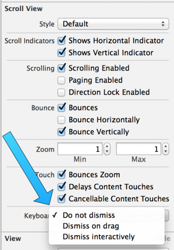
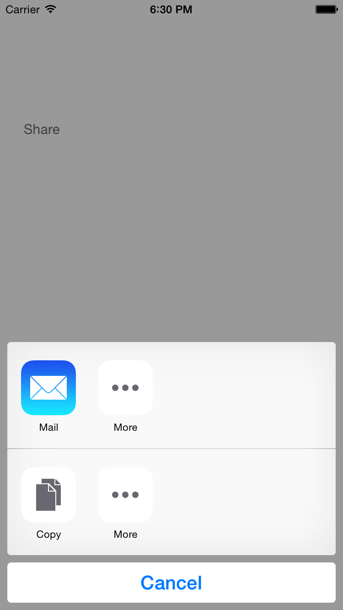
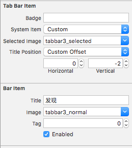

# iOS 学习笔记总结（一）

在iOS开发中经常需要使用的或不常用的知识点的总结，几年的收藏和积累（踩过的坑）。

#### 一、 iPhone Size

| 手机型号 | 屏幕尺寸 |
| --- | :-: |
| iPhone 4 4s | 320 * 480 |
| iPhone 5 5s | 320 * 568 |
| iPhone 6 6s | 375 * 667 |
| iphone 6 plus 6s plus | 414 * 736 |

#### 二、 给navigation Bar 设置 title 颜色

```
UIColor *whiteColor = [UIColor whiteColor];
NSDictionary *dic = [NSDictionary dictionaryWithObject:whiteColor forKey:NSForegroundColorAttributeName];
[self.navigationController.navigationBar setTitleTextAttributes:dic];
```

#### 三、 如何把一个CGPoint存入数组里

```
CGPoint  itemSprite1position = CGPointMake(100, 200);
NSMutableArray * array  = [[NSMutableArray alloc] initWithObjects:NSStringFromCGPoint(itemSprite1position),nil];
    //    从数组中取值的过程是这样的：   
CGPoint point = CGPointFromString([array objectAtIndex:0]);

NSLog(@"point is %@.", NSStringFromCGPoint(point));
```

谢谢@bigParis的建议，可以用NSValue进行基础数据的保存，用这个方法更加清晰明确。

```
CGPoint  itemSprite1position = CGPointMake(100, 200);
NSValue *originValue = [NSValue valueWithCGPoint:itemSprite1position];
NSMutableArray * array  = [[NSMutableArray alloc] initWithObjects:originValue, nil];
//    从数组中取值的过程是这样的：
NSValue *currentValue = [array objectAtIndex:0];
CGPoint point = [currentValue CGPointValue];

NSLog(@"point is %@.", NSStringFromCGPoint(point));
```

现在Xcode7后OC支持**泛型**了，可以用`NSMutableArray<NSString *> *array`来保存。

#### 四、 UIColor 获取 RGB 值

```
UIColor *color = [UIColor colorWithRed:0.0 green:0.0 blue:1.0 alpha:1.0];
const CGFloat *components = CGColorGetComponents(color.CGColor);
NSLog(@"Red: %f", components[0]);
NSLog(@"Green: %f", components[1]);
NSLog(@"Blue: %f", components[2]);
NSLog(@"Alpha: %f", components[3]);
```

#### 五、 修改textField的placeholder的字体颜色、大小

```
self.textField.placeholder = @"username is in here!";
[self.textField setValue:[UIColor redColor] forKeyPath:@"_placeholderLabel.textColor"];
[self.textField setValue:[UIFont boldSystemFontOfSize:16] forKeyPath:@"_placeholderLabel.font"];
```

**推荐**
使用attributedString进行设置.(感谢@[HonglingHe](http://www.jianshu.com/users/1858d9e79e19/latest_articles)的推荐)

```
NSString *string = @"美丽新世界";
    NSMutableAttributedString *attributedString = [[NSMutableAttributedString alloc] initWithString:string];

    [attributedString addAttribute:NSForegroundColorAttributeName
                             value:[UIColor redColor]
                             range:NSMakeRange(0, [string length])];

    [attributedString addAttribute:NSFontAttributeName
                             value:[UIFont systemFontOfSize:16]
                             range:NSMakeRange(0, [string length])];

    self.textField.attributedPlaceholder = attributedString;
```

#### 六、两点之间的距离

```
static __inline__ CGFloat CGPointDistanceBetweenTwoPoints(CGPoint point1, CGPoint point2) { CGFloat dx = point2.x - point1.x; CGFloat dy = point2.y - point1.y; return sqrt(dx*dx + dy*dy);}
```

#### 七、IOS开发－关闭/收起键盘方法总结

1、点击Return按扭时收起键盘

```
- (BOOL)textFieldShouldReturn:(UITextField *)textField 
{
    return [textField resignFirstResponder]; 
}
```

2、点击背景View收起键盘

```
[self.view endEditing:YES];
```

3、你可以在任何地方加上这句话，可以用来统一收起键盘

```
[[[UIApplication sharedApplication] keyWindow] endEditing:YES];
```

#### 八、在使用 ImagesQA.xcassets 时需要注意

**将图片**直接拖入image到ImagesQA.xcassets中时，图片的名字会保留。
**这个时候如果图片的名字过长，那么这个名字会存入到ImagesQA.xcassets中，名字过长会引起SourceTree判断异常。**

#### 九、UIPickerView 判断开始选择到选择结束

**开始选择的**，需要在继承UiPickerView，创建一个子类，在子类中重载

```
- (UIView*)hitTest:(CGPoint)point withEvent:(UIEvent*)event
```

当`[super hitTest:point withEvent:event]`返回不是nil的时候，说明是点击中UIPickerView中了。
**结束选择的**， 实现UIPickerView的delegate方法

```
- (void)pickerView:(UIPickerView*)pickerView didSelectRow:(NSInteger)row inComponent:(NSInteger)component
```

当调用这个方法的时候，说明选择已经结束了。

#### 十、iOS模拟器 键盘事件

当iOS模拟器 选择了Keybaord->Connect Hardware keyboard 后，**不弹出键盘。**

* * *

当代码中添加了

```
[[NSNotificationCenter defaultCenter] addObserver:self
                                             selector:@selector(keyboardWillHide)
                                                 name:UIKeyboardWillHideNotification
                                               object:nil];
```

进行键盘事件的获取。那么在此情景下将不会调用`- (void)keyboardWillHide`.
**因为没有键盘的隐藏和显示。**

#### 十一、在ios7上使用size classes后上面下面黑色

使用了size classes后，在ios7的模拟器上出现了上面和下面部分的黑色

可以在General->App Icons and Launch Images->Launch Images Source中设置Images.xcassets来解决。


十一.png


#### 十二、设置不同size在size classes

Font中设置不同的size classes。


十二.png


#### 十三、线程中更新 UILabel的text

```
[self.label1 performSelectorOnMainThread:@selector(setText:)                                      withObject:textDisplay
                                   waitUntilDone:YES];
```

label1 为UILabel，当在子线程中，需要进行text的更新的时候，可以使用这个方法来更新。
**其他的UIView 也都是一样的。**

#### 十四、使用UIScrollViewKeyboardDismissMode实现了Message app的行为

像Messages app一样在滚动的时候可以让键盘消失是一种非常好的体验。然而，将这种行为整合到你的app很难。幸运的是，苹果给UIScrollView添加了一个很好用的属性keyboardDismissMode，这样可以方便很多。

现在仅仅只需要在Storyboard中改变一个简单的属性，或者增加一行代码，你的app可以和办到和Messages app一样的事情了。

这个属性使用了新的UIScrollViewKeyboardDismissMode enum枚举类型。这个enum枚举类型可能的值如下：

```
typedef NS_ENUM(NSInteger, UIScrollViewKeyboardDismissMode) {
    UIScrollViewKeyboardDismissModeNone,
    UIScrollViewKeyboardDismissModeOnDrag,      // dismisses the keyboard when a drag begins
    UIScrollViewKeyboardDismissModeInteractive, // the keyboard follows the dragging touch off screen, and may be pulled upward again to cancel the dismiss
} NS_ENUM_AVAILABLE_IOS(7_0);
```

以下是让键盘可以在滚动的时候消失需要设置的属性：



十四.png


#### 十五、报错 "_sqlite3_bind_blob", referenced from:

将 sqlite3.dylib加载到framework

#### 十六、ios7 statusbar 文字颜色

iOS7上，默认status bar字体颜色是黑色的，要修改为白色的需要在infoPlist里设置UIViewControllerBasedStatusBarAppearance为NO，然后在代码里添加：
`[application setStatusBarStyle:UIStatusBarStyleLightContent];`

#### 十七、获得当前硬盘空间

```
NSFileManager *fm = [NSFileManager defaultManager];
    NSDictionary *fattributes = [fm attributesOfFileSystemForPath:NSHomeDirectory() error:nil];

    NSLog(@"容量%lldG",[[fattributes objectForKey:NSFileSystemSize] longLongValue]/1000000000);
    NSLog(@"可用%lldG",[[fattributes objectForKey:NSFileSystemFreeSize] longLongValue]/1000000000);
```

#### 十八、给UIView 设置透明度，不影响其他sub views

UIView设置了alpha值，但其中的内容也跟着变透明。有没有解决办法？

设置background color的颜色中的透明度

比如：

```
[self.testView setBackgroundColor:[UIColor colorWithRed:0.0 green:1.0 blue:1.0 alpha:0.5]];
```

设置了color的alpha， 就可以实现背景色有透明度，当其他sub views不受影响**给color 添加 alpha，或修改alpha的值。**

```
// Returns a color in the same color space as the receiver with the specified alpha component.
- (UIColor *)colorWithAlphaComponent:(CGFloat)alpha;
// eg.
[view.backgroundColor colorWithAlphaComponent:0.5];
```

#### 十九、将color转为UIImage

```
//将color转为UIImage
- (UIImage *)createImageWithColor:(UIColor *)color
{
    CGRect rect = CGRectMake(0.0f, 0.0f, 1.0f, 1.0f);
    UIGraphicsBeginImageContext(rect.size);
    CGContextRef context = UIGraphicsGetCurrentContext();
    CGContextSetFillColorWithColor(context, [color CGColor]);
    CGContextFillRect(context, rect);
    UIImage *theImage = UIGraphicsGetImageFromCurrentImageContext();
    UIGraphicsEndImageContext();

    return theImage;
}
```

#### 二十、NSTimer 用法

```
NSTimer *timer = [NSTimer scheduledTimerWithTimeInterval:.02 target:self selector:@selector(tick:) userInfo:nil repeats:YES];

    [[NSRunLoop currentRunLoop] addTimer:timer forMode:NSRunLoopCommonModes];
```

在NSRunLoop 中添加定时器.

#### 二十一、Bundle identifier 应用标示符

Bundle identifier 是应用的标示符，表明应用和其他APP的区别。

#### 二十二、NSDate 获取几年前的时间

eg. 获取到40年前的日期

```
NSCalendar *gregorian = [[NSCalendar alloc] initWithCalendarIdentifier:NSGregorianCalendar];
NSDateComponents *dateComponents = [[NSDateComponents alloc] init];
[dateComponents setYear:-40];
self.birthDate = [gregorian dateByAddingComponents:dateComponents toDate:[NSDate date] options:0];
```

#### 二十三、iOS加载启动图的时候隐藏statusbar

只需需要在info.plist中加入Status bar is initially hidden 设置为YES就好


二十三.jpg


#### 二十四、iOS 开发，工程中混合使用 ARC 和非ARC

Xcode 项目中我们可以使用 ARC 和非 ARC 的混合模式。

如果你的项目使用的非 ARC 模式，则为 ARC 模式的代码文件加入 -fobjc-arc 标签。

如果你的项目使用的是 ARC 模式，则为非 ARC 模式的代码文件加入 -fno-objc-arc 标签。

添加标签的方法：

* 打开：你的target -> Build Phases -> Compile Sources.
* 双击对应的 *.m 文件
* 在弹出窗口中输入上面提到的标签 -fobjc-arc / -fno-objc-arc
* 点击 done 保存

#### 二十五、iOS7 中 boundingRectWithSize:options:attributes:context:计算文本尺寸的使用

之前使用了NSString类的sizeWithFont:constrainedToSize:lineBreakMode:方法，但是该方法已经被iOS7 Deprecated了，而iOS7新出了一个boudingRectWithSize:options:attributes:context方法来代替。
而具体怎么使用呢，尤其那个attribute

```
NSDictionary *attribute = @{NSFontAttributeName: [UIFont systemFontOfSize:13]};
CGSize size = [@"相关NSString" boundingRectWithSize:CGSizeMake(100, 0) options: NSStringDrawingTruncatesLastVisibleLine | NSStringDrawingUsesLineFragmentOrigin | NSStringDrawingUsesFontLeading attributes:attribute context:nil].size;
```

#### 二十六、NSDate使用 注意

NSDate 在保存数据，传输数据中，一般最好使用**UTC时间**。

在显示到界面给用户看的时候，需要转换为**本地时间**。

#### 二十七、在UIViewController中property的一个UIViewController的Present问题

如果在一个UIViewController A中有一个property属性为UIViewController B，实例化后，将BVC.view 添加到主UIViewController A.view上，如果在viewB上进行 `- (void)presentViewController:(UIViewController *)viewControllerToPresent animated: (BOOL)flag completion:(void (^)(void))completion NS_AVAILABLE_IOS(5_0);`的操作将会出现，“ **Presenting view controllers on detached view controllers is discouraged** ” 的问题。

以为BVC已经present到AVC中了，所以再一次进行会出现错误。

可以使用

```
[self.view.window.rootViewController presentViewController:imagePicker
                                                      animated:YES
                                                    completion:^{
                                                        NSLog(@"Finished");
                                                    }];
```

来解决。

#### 二十八、UITableViewCell indentationLevel 使用

UITableViewCell 属性 NSInteger indentationLevel 的使用， 对cell设置 indentationLevel的值，可以将cell 分级别。

还有 CGFloat indentationWidth; 属性，设置缩进的宽度。

总缩进的宽度: **indentationLevel * indentationWidth**

#### 二十九、ActivityViewController 使用AirDrop分享

使用AirDrop 进行分享：

```
NSArray *array = @[@"test1", @"test2"];

UIActivityViewController *activityVC = [[UIActivityViewController alloc] initWithActivityItems:array applicationActivities:nil];

[self presentViewController:activityVC animated:YES
                 completion:^{
                     NSLog(@"Air");
                 }];
```

就可以弹出界面：



二十九.png


#### 三十、获取CGRect的height

获取CGRect的height， 除了 `self.createNewMessageTableView.frame.size.height` 这样进行点语法获取。

还可以使用`CGRectGetHeight(self.createNewMessageTableView.frame)` 进行直接获取。

除了这个方法还有 `func CGRectGetWidth(rect: CGRect) -> CGFloat`

等等简单地方法

```
func CGRectGetMinX(rect: CGRect) -> CGFloat
func CGRectGetMidX(rect: CGRect) -> CGFloat
func CGRectGetMaxX(rect: CGRect) -> CGFloat
func CGRectGetMinY(rect: CGRect) -> CGFloat
```

#### 三十一、打印 %

```
NSString *printPercentStr = [NSString stringWithFormat:@"%%"];
```

#### 三十二、在工程中查看是否使用 IDFA

allentekiMac-mini:JiKaTongGit lihuaxie$ grep -r advertisingIdentifier .
grep: ./ios/Framework/AMapSearchKit.framework/Resources: No such file or directory
Binary file ./ios/Framework/MAMapKit.framework/MAMapKit matches
Binary file ./ios/Framework/MAMapKit.framework/Versions/2.4.1.e00ba6a/MAMapKit matches
Binary file ./ios/Framework/MAMapKit.framework/Versions/Current/MAMapKit matches
Binary file ./ios/JiKaTong.xcodeproj/project.xcworkspace/xcuserdata/lihuaxie.xcuserdatad/UserInterfaceState.xcuserstate matches
allentekiMac-mini:JiKaTongGit lihuaxie$

打开终端，到工程目录中， 输入：
grep -r advertisingIdentifier .

可以看到那些文件中用到了IDFA，如果用到了就会被显示出来。

#### 三十三、APP 屏蔽 触发事件

```
// Disable user interaction when download finishes
[[UIApplication sharedApplication] beginIgnoringInteractionEvents];
```

#### 三十四、设置Status bar颜色

status bar的颜色设置：

1. 如果没有navigation bar， 直接设置

    ```
    // make status bar background color
    self.view.backgroundColor = COLOR_APP_MAIN;
    ```

2. 如果有navigation bar， 在navigation bar 添加一个view来设置颜色。

    ```
    // status bar color
    UIView *view = [[UIView alloc] initWithFrame:CGRectMake(0, -20, ScreenWidth, 20)];
    [view setBackgroundColor:COLOR_APP_MAIN];

    [viewController.navigationController.navigationBar addSubview:view];
    ```

#### 三十五、NSDictionary 转 NSString

```
// Start
NSDictionary *parametersDic = [NSDictionary dictionaryWithObjectsAndKeys:
                               self.providerStr, KEY_LOGIN_PROVIDER,
                               token, KEY_TOKEN,
                               response, KEY_RESPONSE,
                               nil];

NSData *jsonData = parametersDic == nil ? nil : [NSJSONSerialization dataWithJSONObject:parametersDic options:0 error:nil];
NSString *requestBody = [[NSString alloc] initWithData:jsonData encoding:NSUTF8StringEncoding];
```

将dictionary 转化为 NSData， data 转化为 string .

#### 三十六、iOS7 中UIButton setImage 没有起作用

如果在iOS7 中进行设置image 没有生效。

那么说明UIButton的 enable 属性没有生效是NO的。 **需要设置enable 为YES。**

#### 三十七、User-Agent 判断设备

UIWebView 会根据User-Agent 的值来判断需要显示哪个界面。
如果需要设置为全局，那么直接在应用启动的时候加载。

```
- (void)appendUserAgent
{
    NSString *oldAgent = [self.WebView stringByEvaluatingJavaScriptFromString:@"navigator.userAgent"];
    NSString *newAgent = [oldAgent stringByAppendingString:@"iOS"];

    NSDictionary *dic = [[NSDictionary alloc] initWithObjectsAndKeys:
                         newAgent, @"UserAgent", nil];

    [[NSUserDefaults standardUserDefaults] registerDefaults:dic];
}
```

**@“iOS" 为添加的自定义。**

#### 三十八、UIPasteboard 屏蔽paste 选项

当UIpasteboard的string 设置为@“” 时，那么string会成为nil。 **就不会出现paste的选项。**

#### 三十九、class_addMethod 使用

**当 ARC 环境下**

class_addMethod([self class], @selector(resolveThisMethodDynamically), (IMP) myMethodIMP, "v@:");

使用的时候@selector 需要使用super的class，不然会报错。
**当MRC环境下**

class_addMethod([EmptyClass class], @selector(sayHello2), (IMP)sayHello, "v@:");

可以任意定义。但是系统会出现警告，忽略警告就可以。

#### 四十、AFNetworking 传送 form-data

将JSON的数据，转化为NSData, **放入Request的body中**。 发送到服务器就是form-data格式。

#### 四十一、非空判断注意

```
BOOL hasBccCode = YES;
if ( nil == bccCodeStr
    || [bccCodeStr isKindOfClass:[NSNull class]]
    || [bccCodeStr isEqualToString:@""])
{
    hasBccCode = NO;
}
```

如果进行非空判断和类型判断时，**需要新进行类型判断，再进行非空判断，不然会crash**。

#### 四十二、iOS 8.4 UIAlertView 键盘显示问题

可以在调用UIAlertView 之前进行键盘是否已经隐藏的判断。

```
@property (nonatomic, assign) BOOL hasShowdKeyboard;

[[NSNotificationCenter defaultCenter] addObserver:self
                                         selector:@selector(showKeyboard)
                                             name:UIKeyboardWillShowNotification
                                           object:nil];

[[NSNotificationCenter defaultCenter] addObserver:self
                                         selector:@selector(dismissKeyboard)
                                             name:UIKeyboardDidHideNotification
                                           object:nil];

- (void)showKeyboard
{
    self.hasShowdKeyboard = YES;
}

- (void)dismissKeyboard
{
    self.hasShowdKeyboard = NO;
}

while ( self.hasShowdKeyboard )
{
    [[NSRunLoop currentRunLoop] runMode:NSDefaultRunLoopMode beforeDate:[NSDate distantFuture]];
}

UIAlertView* alerview = [[UIAlertView alloc] initWithTitle:@"" message:@"取消修改?" delegate:self cancelButtonTitle:@"取消" otherButtonTitles: @"确定", nil];
[alerview show];
```

#### 四十三、模拟器中文输入法设置

模拟器默认的配置种没有“小地球”，只能输入英文。加入中文方法如下：

选择Settings--->General-->Keyboard-->International KeyBoards-->Add New Keyboard-->Chinese Simplified(PinYin) 即我们一般用的简体中文拼音输入法，配置好后，再输入文字时，点击弹出键盘上的“小地球”就可以输入中文了。
**如果不行，可以长按“小地球”选择中文。**

#### 四十四、iPhone number pad

phone 的键盘类型：

1. number pad 只能输入数字，不能切换到其他输入

    

    number_pad.png

    

2. phone pad 类型： 拨打电话的时候使用，可以输入数字和 + * #

    
    phone_pad.png

    

#### 四十五、UIView 自带动画翻转界面

```
- (IBAction)changeImages:(id)sender
{
    CGContextRef context = UIGraphicsGetCurrentContext();

    [UIView beginAnimations:nil context:context];
    [UIView setAnimationCurve:UIViewAnimationCurveEaseInOut];
    [UIView setAnimationDuration:1.0];

    [UIView setAnimationTransition:UIViewAnimationTransitionCurlDown forView:_parentView cache:YES];
    [UIView setAnimationTransition:UIViewAnimationTransitionCurlUp forView:_parentView cache:YES];
    [UIView setAnimationTransition:UIViewAnimationTransitionFlipFromLeft forView:_parentView cache:YES];
    [UIView setAnimationTransition:UIViewAnimationTransitionFlipFromRight forView:_parentView cache:YES];

    NSInteger purple = [[_parentView subviews] indexOfObject:self.image1];
    NSInteger maroon = [[_parentView subviews] indexOfObject:self.image2];

    [_parentView exchangeSubviewAtIndex:purple withSubviewAtIndex:maroon];

    [UIView setAnimationDelegate:self];
    [UIView commitAnimations];

}
```

#### 四十六、KVO 监听其他类的变量

```
[[HXSLocationManager sharedManager] addObserver:self
                                         forKeyPath:@"currentBoxEntry.boxCodeStr"
                                            options:NSKeyValueObservingOptionNew | NSKeyValueObservingOptionInitial | NSKeyValueObservingOptionOld context:nil];
```

在实现的类self中，进行[HXSLocationManager sharedManager]类中的变量@“currentBoxEntry.boxCodeStr” 监听。

#### 四十七、ios9 crash animateWithDuration

在iOS9 中，如果进行animateWithDuration 时，view被release 那么会引起crash。

```
[UIView animateWithDuration:0.25f animations:^{
        self.frame = selfFrame;
    } completion:^(BOOL finished) {
        if (finished) {
            [super removeFromSuperview];
        }
    }];
```

会crash。

```
[UIView animateWithDuration:0.25f
                          delay:0
         usingSpringWithDamping:1.0
          initialSpringVelocity:1.0 options:UIViewAnimationOptionCurveLinear
                     animations:^{
                         self.frame = selfFrame;
                     } completion:^(BOOL finished) {
                         [super removeFromSuperview];
                     }];
```

不会Crash。

#### 四十八、对NSString进行URL编码转换

iPTV项目中在删除影片时，URL中需传送用户名与影片ID两个参数。当用户名中带中文字符时，删除失败。

之前测试时，手机号绑定的用户名是英文或数字。换了手机号测试时才发现这个问题。

对于URL中有中文字符的情况，需对URL进行编码转换。

```
urlStr = [urlStr stringByAddingPercentEscapesUsingEncoding:NSUTF8StringEncoding];
```

#### 四十九、Xcode iOS加载图片只能用PNG

虽然在Xcode可以看到jpg的图片，但是在加载的时候会失败。
错误为 Could not load the "ReversalImage1" image referenced from a nib in the bun

**必须使用PNG的图片。**

* * *

**如果需要使用JPG 需要添加后缀**

```
[UIImage imageNamed:@"myImage.jpg"];
```

#### 五十、保存全屏为image

```
CGSize imageSize = [[UIScreen mainScreen] bounds].size;
UIGraphicsBeginImageContextWithOptions(imageSize, NO, 0);
CGContextRef context = UIGraphicsGetCurrentContext();

for (UIWindow * window in [[UIApplication sharedApplication] windows]) {
    if (![window respondsToSelector:@selector(screen)] || [window screen] == [UIScreen mainScreen]) {
        CGContextSaveGState(context);
        CGContextTranslateCTM(context, [window center].x, [window center].y);
        CGContextConcatCTM(context, [window transform]);
        CGContextTranslateCTM(context, -[window bounds].size.width*[[window layer] anchorPoint].x, -[window bounds].size.height*[[window layer] anchorPoint].y);
        [[window layer] renderInContext:context];

        CGContextRestoreGState(context);
    }
}

UIImage *image = UIGraphicsGetImageFromCurrentImageContext();

UIGraphicsEndImageContext();
```

#### 五十一、判断定位状态 locationServicesEnabled

这个[CLLocationManager locationServicesEnabled]检测的是整个iOS系统的位置服务开关，无法检测当前应用是否被关闭。通过

```
CLAuthorizationStatus status = [CLLocationManager authorizationStatus];
    if (kCLAuthorizationStatusDenied == status || kCLAuthorizationStatusRestricted == status) {
        [self locationManager:self.locationManager didUpdateLocations:nil];
    } else { // the user has closed this function
        [self.locationManager startUpdatingLocation];
    }
```

**CLAuthorizationStatus**来判断是否可以访问GPS

#### 五十二、微信分享的时候注意大小

text 的大小必须 大于0 小于 10k

image 必须 小于 64k

url 必须 大于 0k

#### 五十三、图片缓存的清空

一般使用SDWebImage 进行图片的显示和缓存，一般缓存的内容比较多了就需要进行清空缓存

清除SDWebImage的内存和硬盘时，可以同时清除session 和 cookie的缓存。

```
// 清理内存
[[SDImageCache sharedImageCache] clearMemory];

// 清理webview 缓存
NSHTTPCookieStorage *storage = [NSHTTPCookieStorage sharedHTTPCookieStorage];
for (NSHTTPCookie *cookie in [storage cookies]) {
    [storage deleteCookie:cookie];
}

NSURLSessionConfiguration *config = [NSURLSessionConfiguration defaultSessionConfiguration];
[config.URLCache removeAllCachedResponses];
[[NSURLCache sharedURLCache] removeAllCachedResponses];

// 清理硬盘
[[SDImageCache sharedImageCache] clearDiskOnCompletion:^{
    [MBProgressHUD hideAllHUDsForView:self.view animated:YES];

    [self.tableView reloadData];
}];
```

#### 五十四、TableView Header View 跟随Tableview 滚动

当tableview的类型为 plain的时候，header View 就会停留在最上面。

当类型为 group的时候，header view 就会跟随tableview 一起滚动了。

#### 五十五、TabBar的title 设置

在xib 或 storyboard 中可以进行tabBar的设置



五十五.png


其中badge 是自带的在图标上添加一个角标。

**1\. self.navigationItem.title 设置navigation的title 需要用这个进行设置。**

**2\. self.title 在tab bar的主VC 中，进行设置self.title 会导致navigation 的title 和 tab bar的title一起被修改。**

#### 五十六、UITabBar,移除顶部的阴影

添加这两行代码：

```
[[UITabBar appearance] setShadowImage:[[UIImage alloc] init]];
[[UITabBar appearance] setBackgroundImage:[[UIImage alloc] init]];
```

顶部的阴影是在UIWindow上的，所以不能简单的设置就去除。

#### 五十七、当一行中，多个UIKit 都是动态的宽度设置


五十七.png


设置horizontal的值，表示出现内容很长的时候，优先压缩这个UIKit。

#### 五十八、JSON的“” 转换为nil

使用AFNetworking 时， 使用

```
AFJSONResponseSerializer *response = [[AFJSONResponseSerializer alloc] init];
response.removesKeysWithNullValues = YES;

_sharedClient.responseSerializer = response;
```

这个参数 removesKeysWithNullValues 可以将null的值删除，那么就Value为nil了

// END

写吐了，那么长应该是没人会看完的，看完了算你狠。

