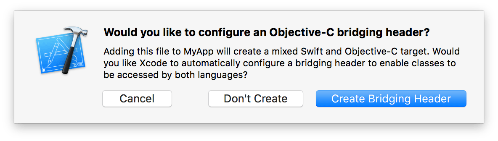
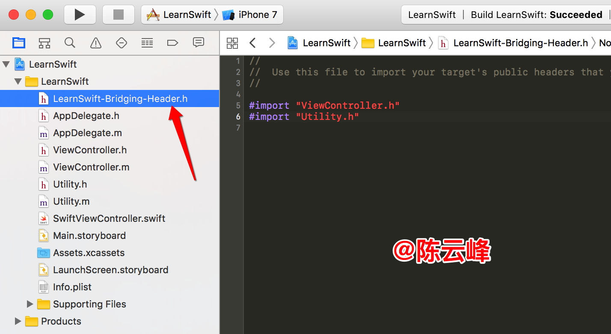
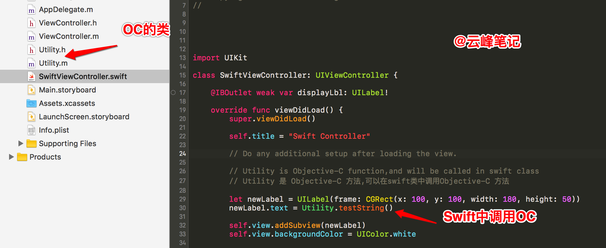
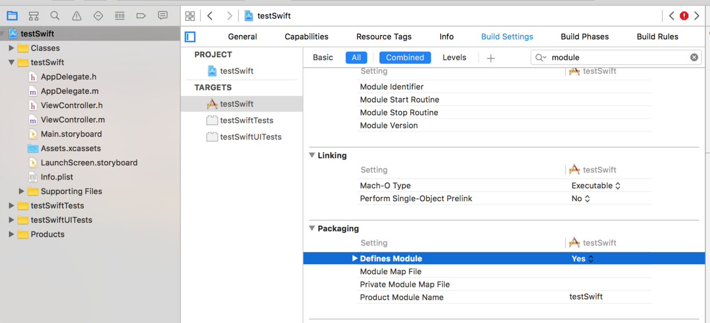
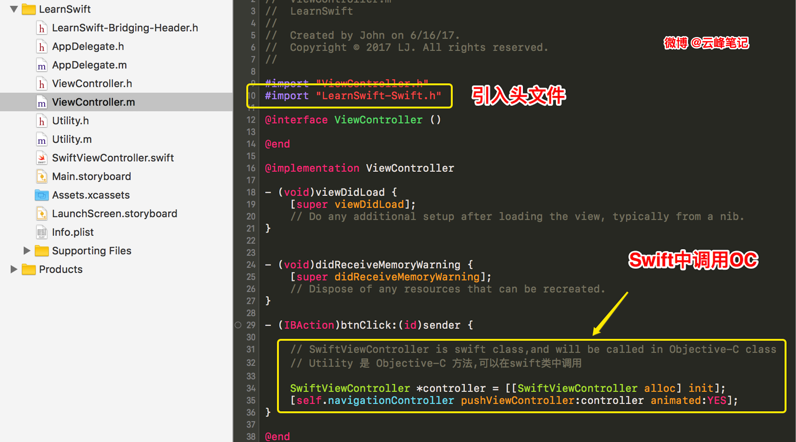

# Swift和Objective-C的相互调用


# （一）Swift调用Objective-C

* 1)已有的OC项目new file 创建swift 文件
* 2)出现如下所示的弹框

    
    

    配置oc桥接头文件的提示
    `ZhuRenWong-Bridging-Header`
* 3)点击`Create Bridging Header`
* 4)自动生成 如下文件
* 
 


* 5)桥接文件中添加OC的.h文件(如上图所示)
* 6)swift 文件中调用OC 方法 如下图所示

 

* **附代码:swift调用OC**

```
    override func viewDidLoad() {
        super.viewDidLoad()
        
        self.title = "Swift Controller"

        // Do any additional setup after loading the view.
        
        // Utility is Objective-C function,and will be called in swift class
        // Utility 是 Objective-C 方法,可以在swift类中调用Objective-C 方法
        
        let newLabel = UILabel(frame: CGRect(x: 100, y: 100, width: 180, height: 50))
        newLabel.text = Utility.testString()

        self.view.addSubview(newLabel)
        self.view.backgroundColor = UIColor.white
        
        
    }
```

# 二) OC中调用Swift 方法

1) 配置define modules为yes
点击工程文件->TARGETS->BuildSettings->Packaging 将Defines Modules 设置为yes, Product Module Name设置为你的工程名



 


此时，系统自动生成 "工程名-Swift.h" 这个文件,只是它不显示出来你看不见而已，这个文件不要手动创建。

> * 理解下`#import "LearnSwift-Swift.h"`
> 其实是`项目名-Swift.h`，这也是Xcode自动生成的，根据你写的所有swift代码，生成一个oc的.h文件，进行类和方法的声明，这样在oc里引用这个头文件后，就相当于引用了所有swift声明，可以直接使用了。

2) 在OC 文件中引入头文件
`#import "ZhuRenWong-Swift.h"`其中`ZhuRenWong`是项目的名称,后面的`-Swift.h` 是固定的写法
3) 写OC的代码
创建对象

```
#import "LearnSwift-Swift.h"

- (IBAction)btnClick:(id)sender {
    
    // SwiftViewController is swift class,and will be called in Objective-C class
    // Utility 是 Objective-C 方法,可以在swift类中调用
    
    SwiftViewController *controller = [[SwiftViewController alloc] init];
    [self.navigationController pushViewController:controller animated:YES];
}

```

如图所示

 


# 三) 最后

我的微博 [@云峰笔记](http://weibo.com/fnote) 简书 [@陈云峰](http://www.jianshu.com/u/abe46f5b31b9) 多多关注，多提意见，互相学习，互相进步！


