# resizableImageWithCapInsets方法探析

# 1\. 故事背景

苹果公司为iOS开发者提供了以下的方法用于处理图片的拉伸问题

```

- (UIImage *)resizableImageWithCapInsets:(UIEdgeInsets)capInsets resizingMode:(UIImageResizingMode)resizingMode
//为行文方便,之后简称该方法为拉伸方法
```

但在实际使用过程中,我发现自己对该方法的理解不够深入,所以今天特地编写了一些代码来探析该方法!
好了,废话不多说,下面我们就开始探析该方法的奥妙吧!

# 2\. 方法介绍和说明

```

- (UIImage *)resizableImageWithCapInsets:(UIEdgeInsets)capInsets resizingMode:(UIImageResizingMode)resizingMode
//该方法返回的是UIImage类型的对象,即返回经该方法拉伸后的图像
//传入的第一个参数capInsets是UIEdgeInsets类型的数据,即原始图像要被保护的区域
//这个参数是一个结构体,定义如下
//typedef struct { CGFloat top, left , bottom, right ; } UIEdgeInsets;
//该参数的意思是被保护的区域到原始图像外轮廓的上部,左部,底部,右部的直线距离,参考图2.1
//传入的第二个参数resizingMode是UIImageResizingMode类似的数据,即图像拉伸时选用的拉伸模式,
//这个参数是一个枚举类型,有以下两种方式
//UIImageResizingModeTile,     平铺 
//UIImageResizingModeStretch,  拉伸
```

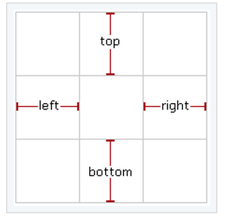
图2.1 capInsets 参数示意图.png

# 3\. 设计实验方法

### 实验对象

Image对象尺寸为60`*`128(为行文方便,之后简称为原始图像,图3.1)
ImageView对象尺寸为180`*`384(为行文方便,之后简称为相框)

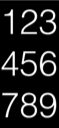
图3.1 原始图像.png

### 实验方法

1. 对原始图像使用拉伸方法并输入不同的参数
2. 将拉伸后的图像放入相框,观察其拉伸效果

### 测试软件的界面设计

界面设计如图3.2
正上方为原始图像窗口,用于显示原始图像的效果
左下方为测试图像窗口,用于显示测试状况的效果
右下方为对比图像窗口,用于显示默认状况的效果

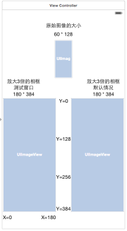
图3.2 测试软件的界面设计.png

# 4.实验分析

### 4.1 拉伸模式

resizingMode参数为UIImageResizingModeStretch

#### 4.1.1.capInsets参数为UIEdgeInsetsMake(0, 0, 0, 0)时

当我们向拉伸方法传入该组参数时,代表我们未对原始图像的任何区域进行保护.其拉伸效果如图4.1.1
**在该种情况下,我们发现原始图像按比例放大了3倍,因此我们将该情况当做拉伸模式下的默认状况**
**在之后的实验中,我们将该种状况当做参考对象,显示在界面的右下角**

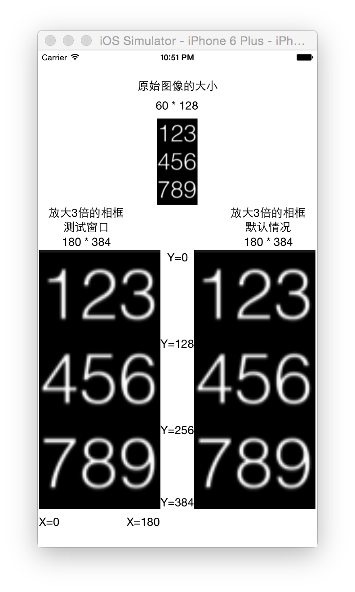
图4.1.1 测试结果1.png

#### 4.1.2.capInsets参数为UIEdgeInsetsMake(42, 0, 0, 0)时

当我们向拉伸方法传入该组参数时,代表我们对原始图像上部的三分之一进行保护(即红色方块区域).其拉伸效果如图4.1.2
**在该种情况下,我们可以发现拉伸后的图像中:**

* 原始图像中受保护的区域(即红色方块区域)在Y轴方向保持了原比例,但在X轴方向进行了拉伸
* 原始图像中未受保护的区域,直接按比例进行了拉伸

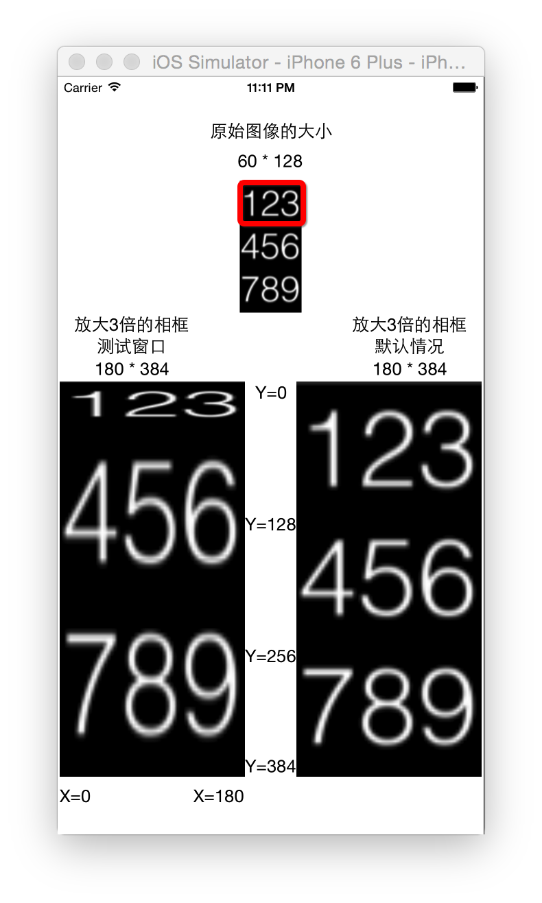
图4.1.2 测试结果2.png

#### 4.1.3.capInsets参数为UIEdgeInsetsMake(0,20, 0, 0)时

当我们向拉伸方法传入该组参数时,代表我们对原始图像左部的三分之一进行保护(即红色方块区域).其拉伸效果如图4.1.3
**在该种情况下,我们可以发现拉伸后的图像中:**

* 原始图像中受保护的区域(即红色方块区域)在X轴方向保持了原比例,但在Y轴方向进行了拉伸
* 原始图像中未受保护的区域,直接按比例进行了拉伸

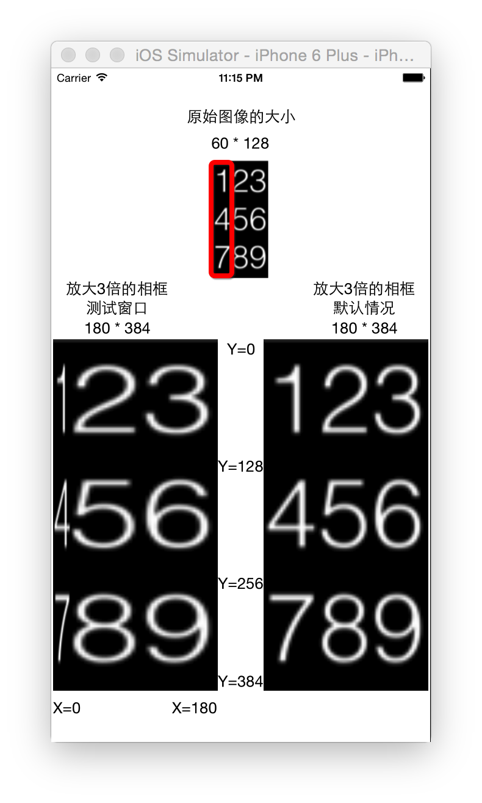
图4.1.3 测试结果3.png

#### 4.1.4.capInsets参数为UIEdgeInsetsMake(42, 20, 42, 20)时

当我们向拉伸方法传入该组参数时,代表我们对原始图像除数字5以外的区域进行保护(即两个红色方块围起来的区域).其拉伸效果如图4.1.4
**在该种情况下,我们可以发现拉伸后的图像中:**

* 在X轴上,由于1被左边和上边的设置保护,3被右边和上边的设置保护,所以只能用中间的2来拉伸,同理最底下的7,8,9
* 在Y轴上,由于1被左边和上边的设置保护,7被左边和下边的设置保护,所以只能用中间的4来拉伸,同理最底下的3,6,9
* 由于5没有被保护,所以在整个剩余的空间中,用5进行拉伸填充

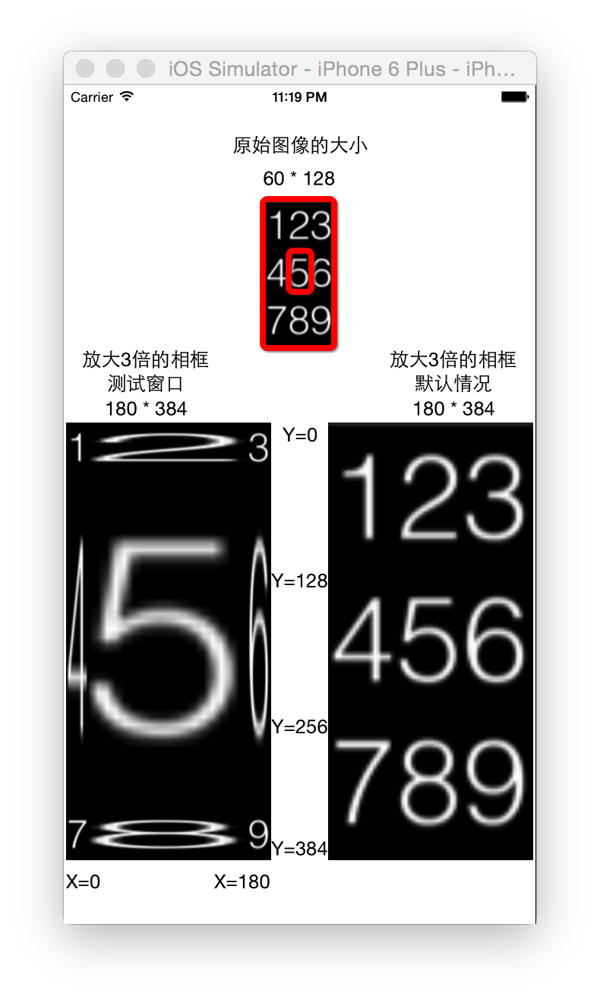
图4.1.4 测试结果4.png

### 4.2选择平铺模式

resizingMode参数为UIImageResizingModeTile

#### 4.2.1.capInsets参数为UIEdgeInsetsMake(0, 0, 0, 0)时

当我们向拉伸方法传入该组参数时,代表我们未对原始图像的任何区域进行保护.其平铺效果如图4.2.1
**在该种情况下,我们发现原始图像按比例填充了相框,因此我们将该情况当做拉伸模式下的默认状况**
**在之后的实验中,我们将该种状况当做参考对象,显示在界面的右下角**

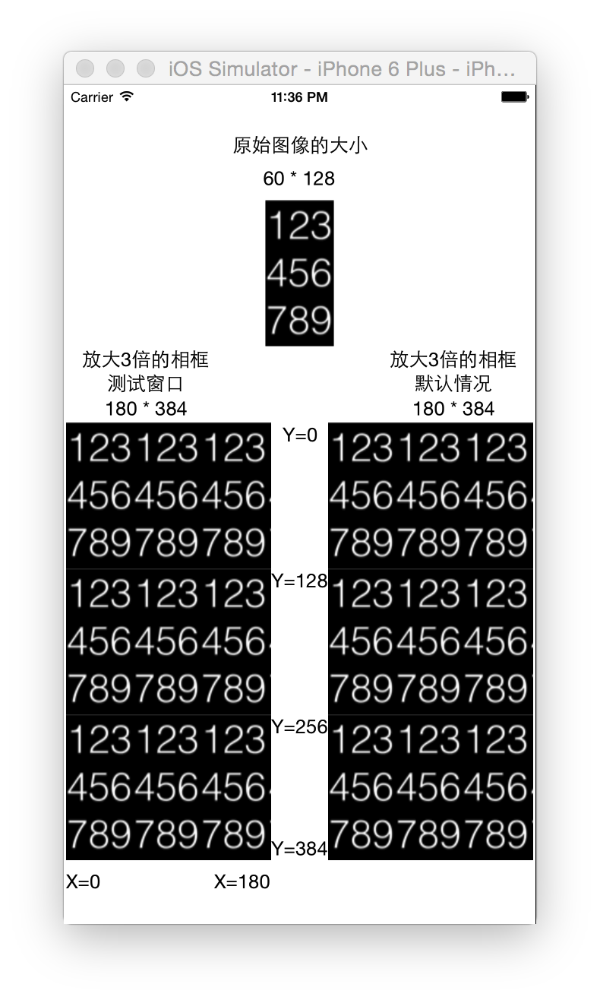
图4.2.1 测试结果1.png

#### 4.2.2.capInsets参数为UIEdgeInsetsMake(42, 0, 0, 0)时

当我们向拉伸方法传入该组参数时,代表我们对原始图像上部的三分之一进行保护(即红色方块区域).其平铺效果如图4.2.2
**在该种情况下,我们可以发现拉伸后的图像中:**

* 原始图像中受保护的区域(即红色方块区域)在Y轴方向保持了原比例,但在X轴方向进行了平铺填充
* 原始图像中未受保护的区域,直接按比例进行了平铺,但不包含被保护的区域(注意观察蓝色箭头所指的区域)

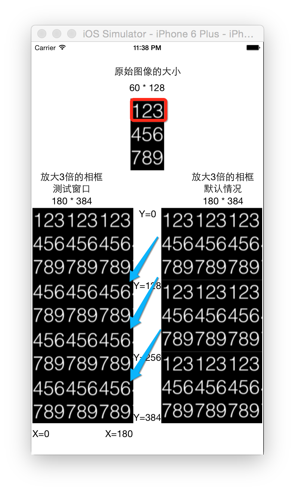
Paste_Image.png

#### 4.2.3.capInsets参数为UIEdgeInsetsMake(0,20, 0, 0)时

当我们向拉伸方法传入该组参数时,代表我们对原始图像左部的三分之一进行保护(即红色方块区域).其平铺效果如图4.2.3
**在该种情况下,我们可以发现拉伸后的图像中:**

* 原始图像中受保护的区域(即红色方块区域)在X轴方向保持了原比例,但在Y轴方向进行了平铺填充
* 原始图像中未受保护的区域,直接按比例进行了平铺,但不包含被保护的区域(注意观察蓝色箭头所指的区域)

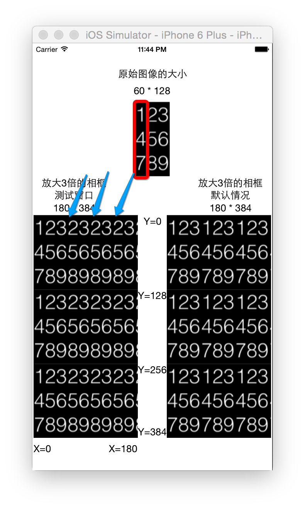
图4.2.3 测试结果3.png

#### 4.2.4.capInsets参数为UIEdgeInsetsMake(42, 20, 42, 20)时

当我们向拉伸方法传入该组参数时,代表我们对原始图像除数字5以外的区域进行保护(即两个红色方块围起来的区域).其拉伸效果如图4.2.4
**在该种情况下,我们可以发现拉伸后的图像中:**

* 在X轴上,由于1被左边和上边的设置保护,3被右边和上边的设置保护,所以只能用中间的2来平铺,同理最底下的7,8,9
* 在Y轴上,由于1被左边和上边的设置保护,7被左边和下边的设置保护,所以只能用中间的4来平铺,同理最底下的3,6,9
* 由于5没有被保护,所以在整个剩余的空间中,用5进行平铺填充

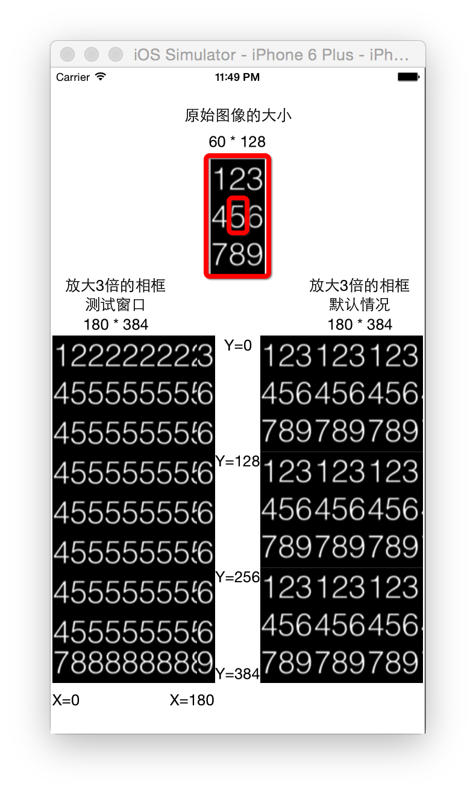
图4.2.4 测试结果4.png

# 5\. 结论和建议

通过8组实验数据可以观察出拉伸方法在平铺模式和拉伸模式下的变化过程和主要区别,由此我们可知:

* 对原始图形使用拉伸方法且在四周增加保护区域后,能保证原始图形的四个角不失真,但其余部分的变化细节则有不同
* 如果原始图像的外轮廓不平整的话,使用拉伸方式会让外轮廓的不平整度放大,使用平铺方式应该能减小这种情况

# 6\. 附录-代码

为了缩短代码的长度,我使用了Storyboard搭建软件界面,想重现实验的朋友可以自行构建界面,具体的参数我在文章和附录中进行了简要说明,我相信聪明的你一定可以搞定!

```

#import "ViewController.h"

@interface ViewController ()
@property (weak, nonatomic) IBOutlet UIImageView *imageView1;
@property (weak, nonatomic) IBOutlet UIImageView *imageView2;
@property (weak, nonatomic) IBOutlet UIImageView *imageView3;
@end

@implementation ViewController

- (void)viewDidLoad {
[super viewDidLoad];

//--imageView1的相关内容------------------------------------------------------------------------------------

//相框大小为60 * 128    图片尺寸为60 * 128
//读取图片
UIImage *testImage1 = [UIImage imageNamed:@"123456789"];

testImage1 = [testImage1 resizableImageWithCapInsets:UIEdgeInsetsMake(0, 0, 0, 0) resizingMode:UIImageResizingModeStretch];
self.imageView1.image = testImage1;

//---imageView2的相关内容-----------------------------------------------------------------------------------

//相框为180 * 384    图片尺寸为60 * 128    相框大小为原始图片的3倍
//读取图片
UIImage *testImage2 = [UIImage imageNamed:@"123456789"];
/***********************************************/
//方法1 resizableImageWithCapInsets:默认是平铺
//方法2 resizableImageWithCapInsets: resizingMode: 方法
//  UIImageResizingModeTile,     平铺
//平铺的概念是保证原图像大小不变,将新图像填充满
//testImage2 = [testImage2 resizableImageWithCapInsets:UIEdgeInsetsMake(0, 0, 0, 0) resizingMode:UIImageResizingModeTile];

//将上部的三分之一"保护",然后进行显示
//这代表新图像中,上部的三分之一和原图像一样,而其余部分的填充不会使用原图像上部的三分之一
// testImage2 = [testImage2 resizableImageWithCapInsets:UIEdgeInsetsMake(42, 0, 0, 0) resizingMode:UIImageResizingModeTile];

//将左部的三分之一"保护",然后进行显示
//这代表新图像中,上部的三分之一和原图像一样,而其余部分的填充不会使用原图像上部的三分之一
// testImage2 = [testImage2 resizableImageWithCapInsets:UIEdgeInsetsMake(0,20, 0, 0) resizingMode:UIImageResizingModeTile];

//将四周进行保护后
//在X轴上,由于1被左边的设置保护,3被右边的设置保护,所以中间只能用2来平铺,同理,7和9之间的8
//在Y轴上,由于1被上边的设置保护,7被下边的设置保护,所以中间只能用4来平铺,同理,3和9之间的6
//由于5没有被保护,所以在整个空间中,用5进行平铺来填充剩余的区域
// testImage2 = [testImage2 resizableImageWithCapInsets:UIEdgeInsetsMake(42, 20, 42, 20) resizingMode:UIImageResizingModeTile];

/***********************************************/
//resizableImageWithCapInsets: resizingMode: 方法
//  UIImageResizingModeStretch,  拉伸
//  拉伸的概念是直接按比例将图片放大到与相框尺寸相同的图像,
//testImage2 = [testImage2 resizableImageWithCapInsets:UIEdgeInsetsMake(0, 0, 0, 0) resizingMode:UIImageResizingModeStretch];

//将上部的三分之一"保护",然后进行显示
//保证原图像上部的三分之一在Y轴上不被拉伸,其余部分按剩余比例拉伸
//testImage2 = [testImage2 resizableImageWithCapInsets:UIEdgeInsetsMake(42, 0, 0, 0) resizingMode:UIImageResizingModeStretch];

//将左部的三分之一"保护",然后进行显示
//保证原图像左部的三分之一在Y轴上不被拉伸,其余部分按剩余比例拉伸
//testImage2 = [testImage2 resizableImageWithCapInsets:UIEdgeInsetsMake(0, 20, 0, 0) resizingMode:UIImageResizingModeStretch];

//将四周进行保护后
//在X轴上,由于1被左边的设置保护,3被右边的设置保护,所以中间只能用2来拉伸,同理,7和9之间的8
//在Y轴上,由于1被上边的设置保护,7被下边的设置保护,所以中间只能用4来拉伸,同理,3和9之间的6
//由于5没有被保护,所以在整个空间中,用5进行拉伸来填充剩余的区域
//testImage2 = [testImage2 resizableImageWithCapInsets:UIEdgeInsetsMake(42, 20, 42, 20) resizingMode:UIImageResizingModeStretch];

//将图片添加到相框
self.imageView2.image = testImage2;

//-----imageView3的相关内容----------------------------------------------------------------------------------

//读取图片
UIImage *testImage3 = [UIImage imageNamed:@"123456789"];

/***********************************************/
//resizableImageWithCapInsets默认是平铺
//resizableImageWithCapInsets默认情况对比图
//testImage3 = [testImage3 resizableImageWithCapInsets:UIEdgeInsetsMake(0, 0, 0, 0) resizingMode:UIImageResizingModeTile];

/***********************************************/
//resizableImageWithCapInsets: resizingMode: 方法
//  UIImageResizingModeTile,     平铺 (已经测试过了,)
//  UIImageResizingModeStretch,  拉伸
//testImage3 = [testImage3 resizableImageWithCapInsets:UIEdgeInsetsMake(0, 0, 0, 0) resizingMode:UIImageResizingModeStretch];
/***********************************************/

//将图片添加到相框
self.imageView3.image = testImage3;
// Do any additional setup after loading the view, typically from a nib.
}

@end
```

**文 | SketchK七爷**


